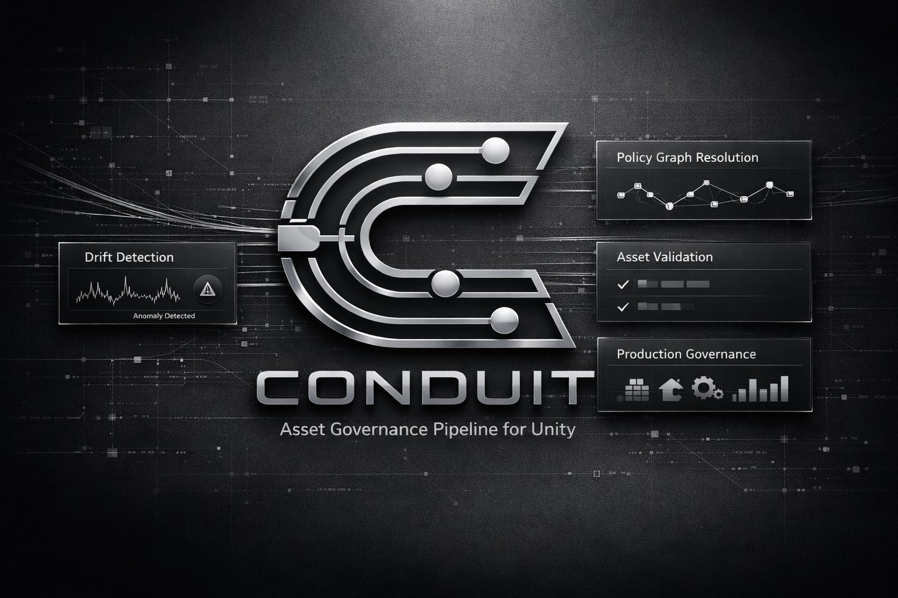
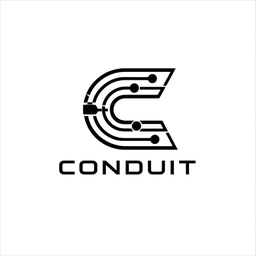

  

  <picture>
    <source media="(prefers-color-scheme: dark)" srcset="images/icon-light.png">
    
  </picture>

<h1 align="center">
  Conduit
</h1>

Policy-driven import governance for Unity.

Documentation and issue tracking for [Conduit](https://assetstore.unity.com/publishers/139782). This repository does not contain Conduit's source code — it holds the documentation site and the public issue tracker. For the package itself, see the Asset Store listing or your Package Manager installation.

## Start here

New to Conduit? Read these in order:

1. [Getting Started](docs/getting-started.md)
2. [Installation](docs/installation.md)
3. [Quick Start](docs/quick-start.md)
4. [Core Concepts](docs/core-concepts.md)

## Documentation

| Topic | |
|---|---|
| [Policies](docs/policies.md) | How folder-scoped rules cascade |
| [Texture Rules](docs/texture-rules.md) | Governing texture import settings |
| [Audio Rules](docs/audio-rules.md) | Governing audio import settings |
| [Model Rules](docs/model-rules.md) | Governing model import settings |
| [Drift Detection](docs/drift-detection.md) | Finding assets out of compliance |
| [Simulation](docs/simulation.md) | Previewing policy effects before applying them |
| [Reimport Workflow](docs/reimport-workflow.md) | Applying policy to drifting assets |
| [Build Gate](docs/build-gate.md) | Blocking non-compliant builds |
| [Demo Workflow](docs/demo-workflow.md) | Installing sample content to try Conduit |
| [Troubleshooting](docs/troubleshooting.md) | Common problems and fixes |
| [FAQ](docs/faq.md) | Short answers to common questions |

## Reference

| Topic | |
|---|---|
| [API Overview](reference/api-overview.md) | The `Conduit` static facade for scripted access |
| [Architecture Overview](reference/architecture-overview.md) | How the pipeline fits together |
| [Configuration Reference](reference/configuration-reference.md) | Every project setting |
| [Supported Features](reference/supported-features.md) | What Conduit governs today |
| [Limitations](reference/limitations.md) | What Conduit doesn't do, and why |

## Release

| Topic | |
|---|---|
| [Changelog](release/changelog.md) | What changed, by version |
| [Roadmap](release/roadmap.md) | What's planned |
| [Version History](release/version-history.md) | Compatibility across Unity versions |

## Support

[Email Support](mailto:support.toolsstudio@gmail.com) ·
[Report an Issue](https://github.com/toolsstudio/conduit-docs/issues) ·
[Request a Feature](https://github.com/toolsstudio/conduit-docs/issues) ·
[Community Discord](https://discord.gg/VrbxQ9vnrT)

See [Support](support/report-issues.md) for the full workflow.
