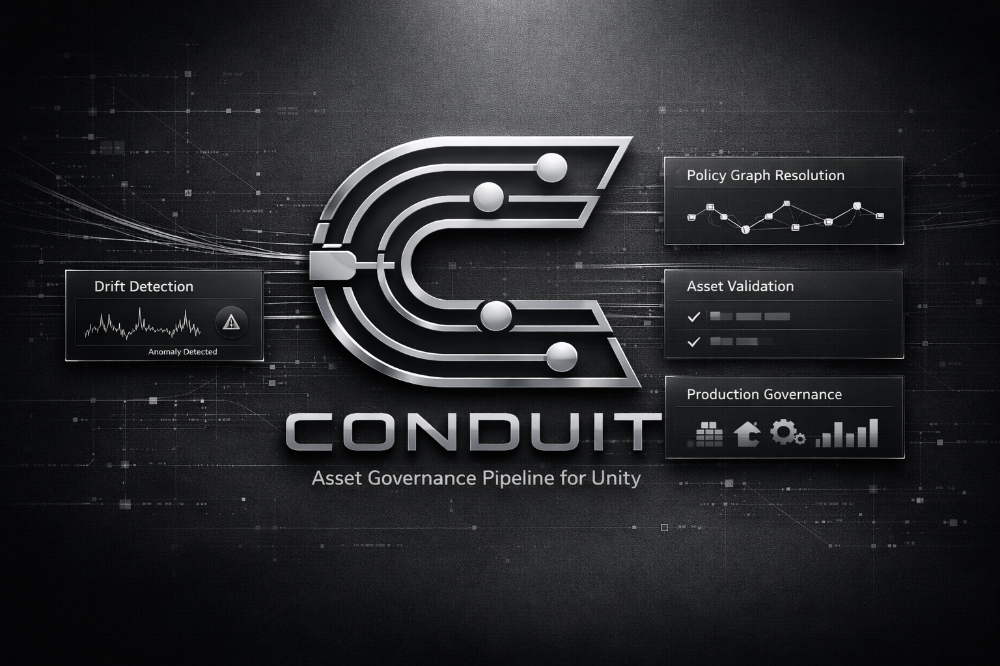
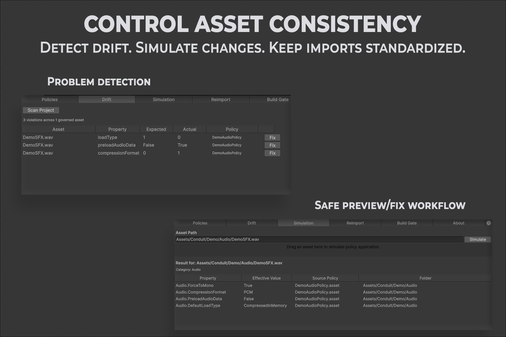
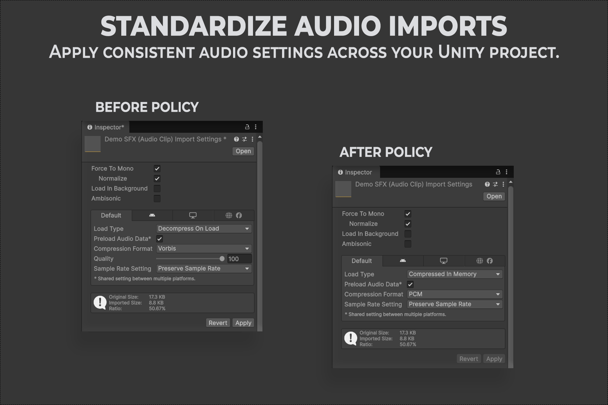
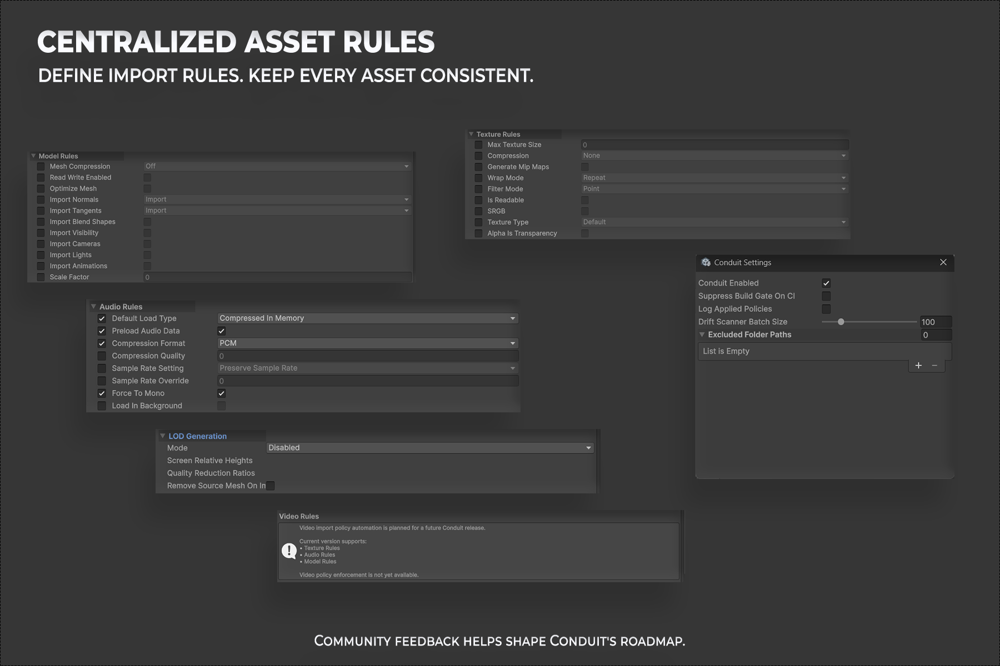

  

<h1 align="center">Conduit</h1>

<b>Policy-driven asset import governance for Unity.</b>

  

  
  

  
  
  

---

Documentation and issue tracking for Conduit. This repository does not contain Conduit's source code — it holds the documentation site and the public issue tracker. For the package itself, use the Unity Asset Store button above or your Package Manager installation.

## Screenshots

### Policy Authoring

Define per-folder import rules for textures, models, and audio from a single policy editor.

  

**What this shows:** the Policies tab governing `Assets/Conduit/Demo/Audio`. The folder tree on the left shows policy coverage at a glance, while the panel on the right toggles individual Audio Rules — load type, compression format, quality, and more — each governed by an enforcement level of `Disabled`, `Warn Only`, or `Block Build`.

### Drift Detection & Simulation

Detect assets that have drifted from policy, then preview exactly what would change before touching anything.

  

**What this shows:** the Drift tab (top) lists every violation found by a project scan — the affected asset, the property, and its expected versus actual value — with a one-click **Fix** per row. The Simulation tab (bottom) shows the effective policy for any asset, including which policy asset and folder each property is inherited from, without changing anything on disk.

### Reimport Workflow

Apply policy to your whole project or just the assets that have drifted, with a clear before/after summary.

  

**What this shows:** Full Reimport (top) walks every governed asset in scope and reports the size change for each after policy is reapplied, then prompts a Drift scan to confirm compliance. Targeted Reimport (bottom) narrows the same workflow to only the assets flagged by the most recent Drift scan.

### Before & After Policy Application

See the real effect of a policy on an asset's Inspector, side by side.

  

**What this shows:** the same audio clip before a policy is applied (left) and after (right). Force To Mono, Load Type, Compression Format, and Sample Rate Setting all update to match the governing policy, and the resulting file size drops from 17.3 KB to 8.8 KB.

### Centralized Rule Coverage

Every governed property, and the project-wide settings that control how Conduit behaves, in one place.

  

**What this shows:** the full set of Model, Texture, Audio, and LOD Generation rules Conduit can enforce, alongside the Conduit Settings panel — where Conduit can be enabled or disabled project-wide, the Build Gate can be suppressed on CI, and specific folders can be excluded from scanning entirely.

---

## Start here

New to Conduit? Read these in order:

1. [Getting Started](docs/getting-started.md)
2. [Installation](docs/installation.md)
3. [Quick Start](docs/quick-start.md)
4. [Core Concepts](docs/core-concepts.md)

## Documentation

| Topic | |
|---|---|
| [Policies](docs/policies.md) | How folder-scoped rules cascade |
| [Texture Rules](docs/texture-rules.md) | Governing texture import settings |
| [Audio Rules](docs/audio-rules.md) | Governing audio import settings |
| [Model Rules](docs/model-rules.md) | Governing model import settings |
| [Drift Detection](docs/drift-detection.md) | Finding assets out of compliance |
| [Simulation](docs/simulation.md) | Previewing policy effects before applying them |
| [Reimport Workflow](docs/reimport-workflow.md) | Applying policy to drifting assets |
| [Build Gate](docs/build-gate.md) | Blocking non-compliant builds |
| [Demo Workflow](docs/demo-workflow.md) | Installing sample content to try Conduit |
| [Troubleshooting](docs/troubleshooting.md) | Common problems and fixes |
| [FAQ](docs/faq.md) | Short answers to common questions |

## Reference

| Topic | |
|---|---|
| [API Overview](reference/api-overview.md) | The `Conduit` static facade for scripted access |
| [Architecture Overview](reference/architecture-overview.md) | How the pipeline fits together |
| [Configuration Reference](reference/configuration-reference.md) | Every project setting |
| [Supported Features](reference/supported-features.md) | What Conduit governs today |
| [Limitations](reference/limitations.md) | What Conduit doesn't do, and why |

## Release

| Topic | |
|---|---|
| [Changelog](release/changelog.md) | What changed, by version |
| [Roadmap](release/roadmap.md) | What's planned |
| [Version History](release/version-history.md) | Compatibility across Unity versions |

## Support

  
  

  
  

See [Report Issues](support/report-issues.md) for the full workflow.
