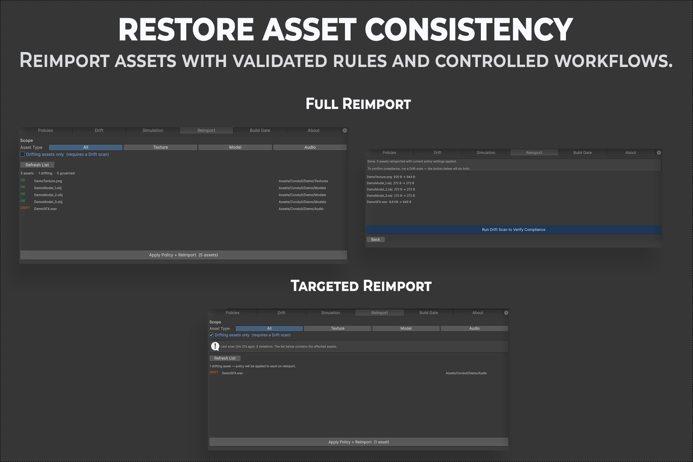

# Reimport Workflow

The **Reimport** tab applies policy to a chosen set of assets and reimports them, independent of a drift scan.

  

Both modes: a full reimport across every governed asset in scope (top), and a targeted reimport limited to the assets a drift scan flagged (bottom), each with a before and after size summary once it runs.

## Purpose

Force a set of assets to pick up current policy values immediately, for example after changing a policy, without waiting for the next drift scan.

## Workflow

### Scope

Filter by asset type (All, Texture, Model, or Audio) and optionally limit the list to drifting assets only, which requires a drift scan to have run first. Click **Refresh List** to populate the list under the current filter.

### Selecting assets

Check the assets you want to reimport. The **Apply Policy + Reimport** button shows the selected count and stays disabled until at least one asset is selected.

### What happens on execution

For each selected asset, Conduit finds its governing policy, applies every governed property to the asset's importer, and reimports it, the same way Unity's own Inspector does when you click Apply on an importer.

This overwrites the asset's current import settings with whatever the policy specifies, for every governed property, whether or not that property was drifting. Conduit shows a confirmation naming the affected asset count before proceeding. This cannot be undone through Conduit, so use Unity's standard undo or your version control if you need to revert.

## Reimport compared with Fix All

Both apply policy and reimport. Fix All in the Drift tab works on the current scan's violation list. Reimport lets you choose a broader or narrower set directly, including assets that are not currently drifting. That is useful after changing a policy, when you want every asset in scope to pick up the new values immediately.
