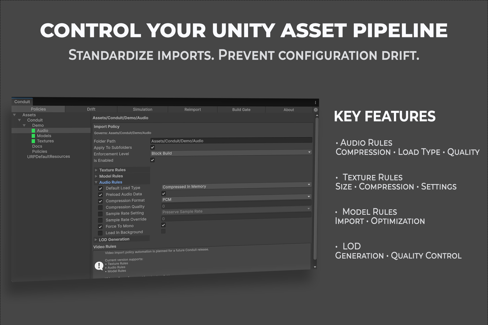

# Overview

Conduit is a Unity Editor tool that governs asset import settings by folder. You define a policy once for a folder, and Conduit keeps every texture, model, and audio clip in that folder, and its subfolders, compliant with it.

This documentation covers Conduit 1.0.0.

## The problem Conduit solves

Import settings drift over time. Someone changes a texture's compression to test something, forgets to revert it, and it ships that way. A new artist adds assets without knowing the project's conventions. Nobody notices until a build is larger than it should be or a platform behaves inconsistently.

Conduit replaces manual conventions and hand-written import scripts with a folder-scoped policy system: define the rules once, and every asset in scope is checked, applied, and kept in sync.

## Key capabilities

- Folder-scoped, cascading policies with per-property opt-in
- Texture, Model, and Audio import rules, with per-platform overrides for textures and audio
- LOD generation by hierarchy cloning at configurable screen-relative heights
- Three enforcement levels: Disabled, Warn Only, and Block Build
- Asynchronous, cancellable drift scanning across the whole project or a single folder
- Read-only simulation of the resolved policy for any single asset
- Manual reimport with type and drift-only filtering
- A build gate that stops non-compliant builds, with a command-line equivalent for CI
- Scripted access to every workflow from your own Editor scripts
- Editor-only: Conduit adds nothing to your player builds

  

The Policies tab: the folder tree on the left shows policy coverage, and the panel on the right toggles individual rules. Each rule is opt-in, and the whole policy carries one enforcement level.

## Distribution and licensing

Conduit is a paid, proprietary Unity Editor tool distributed through the Unity Asset Store and licensed under the Unity Asset Store EULA. The Asset Store package includes the Conduit Runtime and Editor C# source. The development GitHub repository that produces it is private, and access to it is provided separately to authorized users.

## Compatibility

Verified on Unity 6000.3.10f1. Other Unity versions have not been verified; additional Editor verification is required before compatibility with them is claimed.

See [Installation](installation.md) for the full compatibility statement.

## Known limitations

- Video import settings appear in a policy but are not enforced. Video rules are planned for a future release.
- LOD generation does not reduce polygon count. Each LOD level uses the same mesh as the source.
- A policy governs a folder. There is no way to exempt a single asset inside an otherwise governed folder.
- Conduit applies policy at import time and on an explicit Reimport or Fix action. It does not watch already-imported assets in the background.
- Model Rules have no per-platform overrides.
- Two audio settings, Normalize and Ambisonic, are intentionally not exposed as rules. See [Audio Rules](features/audio-rules.md).
- Only textures, models, and audio are governed. Other asset types are untouched.

## Quick links

- [Getting Started](getting-started.md)
- [Installation](installation.md)
- [Policies](features/policies.md)
- [Troubleshooting](troubleshooting.md)
- [FAQ](faq.md)
